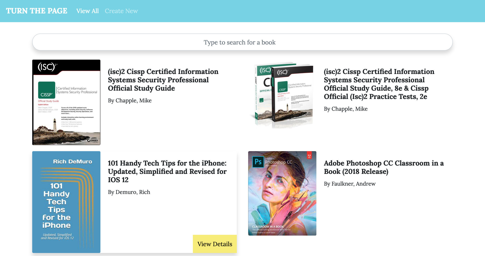

# Turn The Page
**[Angular & NgRx] Book Database with Search, Create, Read and Delete Functionality**

## Live Version

* https://turn-the-page-464e5.firebaseapp.com/

## Getting Started

#### Start JSON Server

* `npm install -g json-server`
* `json-server --watch db.json`

#### Start Development Server

* `npm install`
* `ng serve -o`

## Description

User Stories:

* Search for book(s)
* [Create] Add new book
* [Read] List all books / one book
* [Delete] Delete a book

## Future Implementations

* Get book from api if book is not in store
* Include update functionality
* Authentication (Register/Login/Logout)
* Indicate actual error status in error page

## Built With

* [Angular 6](https://angular.io/)
* [Bootstrap 4](https://getbootstrap.com/)
* [NgRx](https://ngrx.io/)
* [ngrx-store-localstorage](https://github.com/btroncone/ngrx-store-localstorage)
* [JSON Server](https://github.com/typicode/json-server)

## Acknowledgements
* Favicon from [Open Book Free Icon](https://icons8.com/icon/52991/open-book)
* Broken robot image from [iStockphoto LP.](https://www.istockphoto.com/sg/vector/broken-robot-gm599486444-102908267)
* Data extracted from [OpenTrolley Bookstore Pte. Ltd.](https://opentrolley.com.sg/bestseller/computers)